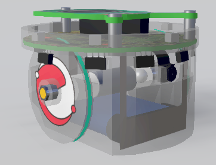
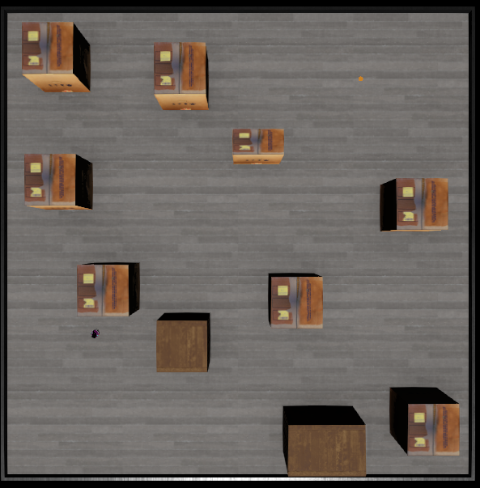
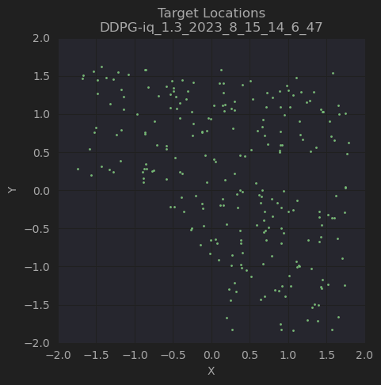

# Continuous Learning in Non-Stationary Environments

This repository contains the code from my MSc thesis. While it can be used to reproduce my results, 
the main purpose of making it available is to provide a starting point for people wanting to train 
a DDPG agent in a simulation environment, in this case Webots.

The agent is a standard e-puck robot and the environment is a 4 x 4 meter arena with 10 randomly placed 
obstacles. The task is to learn mapless navigation to the target location.

### The agent

The agent is an e-puck robot with 8 proximity sensors, compass and GPS. It can be found 
[here](https://www.cyberbotics.com/doc/guide/epuck?version=R2021a#!).




### The algorithm

A DDPG implementation based on the implementation by 
[Nimish Sanghi](https://github.com/Apress/deep-reinforcement-learning-python) 
in his helpful book [Deep Reinforcement Learning with Python](https://www.amazon.co.uk/Deep-Reinforcement-Learning-Python-TensorFlow/dp/1484268083).

This is modified to operate with Webots (the original is presented for use with OpenAI Gym) and several extensions
are added. These include: <br>
- A prioritised replay buffer to improve learning speed. <br>
- Use of the SELU activation function for one layer in the actor and critic networks for its regularising properties. <br>
- Parameterised sigmoid activation function for the actor output layer to stabilise the action output values. <br>
  - Implemented from the paper by [Hossney et al.](https://www.mdpi.com/2673-2688/2/4/29) <br>
- Addition of n-step returns to further stabilise learning. <br>


### Exploration

Exploration is an important topic within DDPG. The original paper uses Ornstein-Uhlenbeck noise, but this is not 
more effective that simple Gaussian noise in this case. It should be noted that the noise is not related to 
environment exploration, but to actuator (wheel drive) exploration. 

Initial environment exploration is achieved by providing random forward motion to the robot, 
this gathering experiences for the 
agent to learn from. After this, the standard DDPG exploration method of adding noise to the action output is used to 
refine the policy further over time.

It is strongly recommended that this method of activation exploration is used and that a suitable form of 
environmental exploration is used for the training environment you are using. 

### The training environment

In this case, the training environment is very simple. The agent is placed in a 4 x 4 meter arena with 10 randomly
placed obstacles. The agent is tasked with navigating to a randomly placed target location. The agent is rewarded
for moving towards the target and penalised for colliding with obstacles. The episode ends when the agent reaches
the target or runs out of time. Note, the episode is not reset on collision with an obstacle since this prevents
effective learning in this case.

As shown below, the agent starts in the bottom left and must reach the randomly placed orange target (top right). 
In navigating to the target, it must avoid the obstacles.



The target location placement during training and testing is randomised and covers the area quite evenly as shown here.



The agent starts in the bottom-left, so the target is placed such that some navigation is required to reach it. 
It should be noted from a practice perspective, that arranging the training so that the target is always in the top
right, with obstacles between the start and target locations, will not work since the agent does not see enough
of the portion between obstacles and target to learn what to do. The random placement operates as a form of Curriculum
Learning, allowing the agent to collect experiences of the full journey to the target.

## Using the code

Install [Webots](https://cyberbotics.com/) and set it up with your IDE of choice [like this](https://cyberbotics.com/doc/guide/using-your-ide). 
I use PyCharm, but it should work with most IDEs.

Create a new environment and install the requirements from requirements.txt.

```bash
pip install numpy notebook matplotlib scikit-learn pandas
```

Install PyTorch from [here](https://pytorch.org/get-started/locally/).

Clone this repository and open it in your IDE.

```bash
git clone git@github.com:Levinin/webots_epuck_ddpg.git
```

Open Webots and load the world file [e-puck_mapless_nav_con1.wbt](worlds%2Fe-puck_mapless_nav_con1.wbt)

### Adjust the hyperparameters

Hyperparameters are set in two places. Firstly, in the supervisor script 
[supervisor_ddpg.py](controllers%2Fsupervisor_ddpg%2Fsupervisor_ddpg.py) 
and secondly in the hyperparameters file [hyperparameters.py](controllers%2Fepuck_controller_ddpg%2Fhyperparameters.py).

### Run the agent
The agent is run through Webots and will offer the following options:
- 't' to train a policy
- 'r' to run a policy
- 'i' to measure interference while training a policy
- 'q' to quit

During the run, data will be saved to the sqlite3 database in the logs directory. <br>
To view performance, access the database in the normal way, an example is given in the 
jupyter notebook provided [here](controllers%2Fepuck_controller_ddpg%2Freward_plots.ipynb).

When training an agent, the weights and replay buffer will be stored in the 'models' 
and 'replays' directories. To run a pre-trained agent, place the weights and replay 
you want to load into the respective 'load' directories. The agent will load the most
recently modified file in these directories.

## Database schema

Two databases are used. The main database is data_logs.db and has the following schema:

```sql
sqlite> .schema

CREATE TABLE agent_data (
id INTEGER PRIMARY KEY,
run_id TEXT,
episode INTEGER,
step INTEGER,
step_reward FLOAT,
episode_end BOOL,
goal_achieved BOOL,
timestamp DATETIME DEFAULT CURRENT_TIMESTAMP,
run_type TEXT,
x FLOAT,
y FLOAT);

CREATE TABLE optimise_data (
id INTEGER PRIMARY KEY,
run_id TEXT,
step INTEGER,
q_loss FLOAT,
a_loss FLOAT,
inter FLOAT,
q_val FLOAT,
episode INTEGER,
timestamp DATETIME DEFAULT CURRENT_TIMESTAMP);
```

The second database is an application log and has the following schema:

```sql
sqlite> .schema

CREATE TABLE app_log (
id INTEGER PRIMARY KEY,
timestamp DATETIME DEFAULT CURRENT_TIMESTAMP,
level TEXT,
function TEXT,
message TEXT);
```

